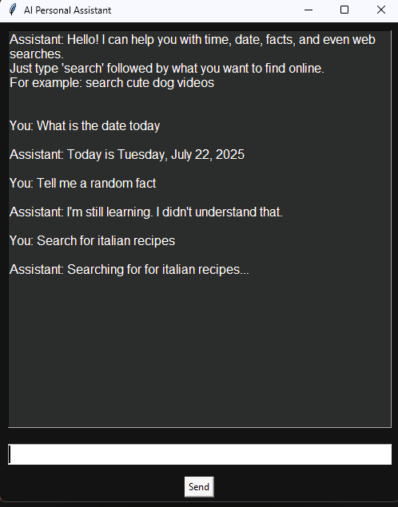

# 🧠 AI Personal Assistant Robot

A simple yet powerful AI personal assistant with a graphical user interface built using Python and Tkinter. It can respond to user input using NLP and perform tasks such as providing the time, date, random facts, and web searches.

---

## ✨ Features

- 🗨️ Clean and responsive GUI (Tkinter)
- 🧠 Natural Language Processing (custom intent parser)
- 🗓️ Tells current date and time
- 🌐 Web search functionality (type: `search your topic`)
- 🔊 Text-to-speech responses
- 🔌 Modular code design (NLP, tasks, speech separated)

---

## 🖼️ Screenshot




---

## ⚙️ Installation

### 1. Clone the repository:

```bash
git clone https://github.com/Nomahk25/ai-personal-assistant-robot.git
cd ai-personal-assistant-robot
```
### 2. Install required packages:
```
pip install -r requirements.txt
```

## 🚀 How to Run

```
python gui_main.py
```
You’ll see a GUI window where you can type your commands. Try:
What time is it?
Tell me a fun fact
Search Python tutorials

## 🔍 How It Works

- User input is processed using interpret_command() from nlp.py.
- Parsed command is passed to execute_command() in tasks.py.
- The assistant responds by text and optionally with voice using speech.py.

## 💡 Inspiration

Inspired by voice-based smart assistants like Siri and Google Assistant, this project is meant to offer similar functionality using open tools like Python, with a lightweight GUI for accessibility and user-friendliness.

## 🤝 Contributing

Feel free to fork the project, improve it, and submit pull requests!

Ideas:

- Add voice input using speech_recognition
- Integrate calendar/reminders
- Theme toggle (dark/light)
- Voice selection or mute toggle
- Use GPT API for smarter conversation
- Add plugin system for custom skills

## 👤 Author

Nomanguni Khumalo
📍 Johannesburg, South Africa

## 📄 License

This project is licensed under the MIT License – see the LICENSE file for details.


